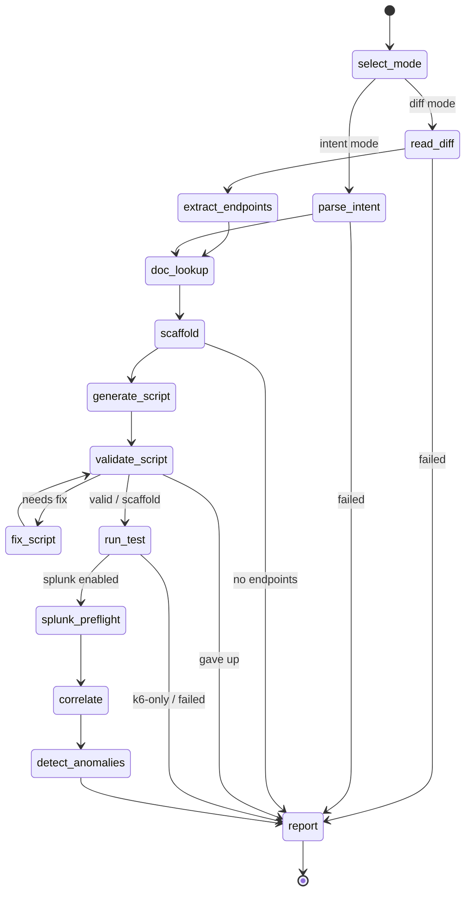

<p align="center"></p>

# kassi

> Divinate your stack's performance.

An agentic, closed-loop load-testing and observability tool. Point it at a code
change (a git diff) or describe an intent in plain language; it picks the affected
HTTP endpoints, generates a k6 load test, runs it, then correlates the client-side
results with the target service's **server-side telemetry in Splunk** and reports a
combined verdict.

Named for the seer who saw what others would not believe, kassi reads a change and
foretells how it behaves under load. The workflow is themed as a tarot draw: the agent
turns one card of the Major Arcana per phase (`kassi arcana` lays out the full spread).

kassi is a [Burr](https://github.com/apache/burr) state machine served over MCP by
[Theodosia](https://msradam.github.io/theodosia/). An agent drives the workflow one
`step` at a time. The graph's edges are the only legal moves: an illegal step is
refused with the list of valid next actions, and every step (and every refusal) is
recorded to an immutable, hash-chained ledger. One agent orchestrates **two MCP
servers** as upstreams, neither visible to the driving agent:

- the official [Grafana k6 MCP server](https://github.com/grafana/mcp-k6) validates
  and runs the load test;
- the official [Splunk MCP Server](https://splunkbase.splunk.com/app/7931) runs SPL
  to pull the target's server-side telemetry over the exact test window.

Built for the Splunk Agentic Ops Hackathon (Observability track). See
[`architecture_diagram.md`](architecture_diagram.md) and
[`docs/SUBMISSION.md`](docs/SUBMISSION.md).


The demo above is recorded from [`docs/demo.tape`](docs/demo.tape) with
[vhs](https://github.com/charmbracelet/vhs): it prints the state machine, then drives the
whole workflow end-to-end (plan filled by Claude Haiku, k6 docs + run, Splunk preflight
and correlation) against a live Splunk.

### Screenshots

| | |
| --- | --- |
|  |  |
| **`kassi render`**: 11 actions, legal edges only | **`kassi arcana`**: a card per phase |
|  |  |
| **`kassi doctor --runtime`**: graph + governance checks | **a full run**: k6 + Splunk correlated, every tool call logged |

## Install

```bash
uv sync
```

kassi delegates all k6 and Splunk work to MCP servers; provide them on the host:

```bash
# k6 MCP server: install k6 2.0+; the server is the built-in `k6 x mcp` subcommand,
# provisioned automatically on first use. Warm the extension cache once up front so
# the first run does not stall while it downloads:
brew install k6                                     # or see https://k6.io/docs/get-started/installation
kassi warm-k6

# Standalone binary instead (set KASSI_K6_CMD=mcp-k6):
#   brew tap grafana/grafana && brew install mcp-k6
# Docker instead (set KASSI_K6_DOCKER=1):
#   docker pull grafana/mcp-k6:latest

# Splunk MCP Server: install the app on your Splunk instance, add the
# mcp_tool_execute capability to your role, generate an encrypted token, and copy
# the endpoint from the app. The npx-based stdio bridge needs Node.js.
```

The model authors the k6 script (on top of the deterministic scaffold) and narrates the
run; it never writes SPL. A local [Ollama](https://ollama.com) model is used by default
(`qwen2.5-coder:7b`); set `KASSI_LLM=anthropic` to use the Claude Messages API instead
(`claude-haiku-4-5`, needs `ANTHROPIC_API_KEY`). If the backend is unreachable, kassi runs
the deterministic scaffold and falls back to the static omens for the narration.

The Splunk step is optional: without `KASSI_SPLUNK_MCP_ENDPOINT` + `KASSI_SPLUNK_TOKEN`
set, kassi skips correlation and runs k6-only.

## Usage

Inspect and serve the workflow:

```bash
kassi doctor --runtime     # validate the graph and runtime tool shape
kassi render               # print the state machine
kassi serve                # mount as an MCP server over stdio (both upstreams wired in)
```

Drive it from Claude Code by registering the server:

```bash
claude mcp add --scope=user --transport=stdio kassi -- kassi serve
```

Then ask the agent to run the workflow with the `step` tool, for example:
"Use the kassi step tool. Load test the pet listing endpoint against
http://localhost:8000; the spec is under examples/petstore; correlate with Splunk
index web."

The entry inputs for `select_mode`:

- diff mode: `{"repo_path": "/path/to/repo", "ref": "HEAD~1", "target_base_url": "http://localhost:8000", "splunk_index": "web"}`
- intent mode: `{"repo_path": "/path/with/openapi.json", "intent": "load test the checkout endpoint", "target_base_url": "...", "splunk_index": "web"}`

Review recorded runs:

```bash
kassi sessions ls
kassi sessions show <app-id>
kassi logs <app-id> --refusals
kassi verify <app-id>        # confirm the ledger has not been tampered with
```

## Configuration

| Variable | Default | Purpose |
| --- | --- | --- |
| `KASSI_LLM` | `ollama` | model backend for script authoring + narration: `ollama` or `anthropic` |
| `KASSI_MODEL` | `qwen2.5-coder:7b` / `claude-haiku-4-5` | model tag (Ollama tag, or Claude model id when `KASSI_LLM=anthropic`) |
| `OLLAMA_HOST` | `http://localhost:11434` | Ollama endpoint (when `KASSI_LLM=ollama`) |
| `ANTHROPIC_API_KEY` | unset | Claude API key (when `KASSI_LLM=anthropic`) |
| `KASSI_K6_CMD` | `k6 x mcp` | command line for the k6 MCP server (set to `mcp-k6` for the standalone binary) |
| `KASSI_K6_DOCKER` | unset | if set, run the k6 MCP server via Docker |
| `KASSI_K6_IMAGE` | `grafana/mcp-k6:latest` | Docker image when `KASSI_K6_DOCKER` is set |
| `KASSI_SPLUNK_MCP_ENDPOINT` | unset | streamable-HTTP endpoint of the Splunk MCP Server (e.g. `https://localhost:8089/services/mcp`) |
| `KASSI_SPLUNK_TOKEN` | unset | encrypted MCP token (sent as `Authorization: Bearer`) |
| `KASSI_SPLUNK_MCP_CMD` | `npx` | stdio bridge command (runs `mcp-remote`) |
| `KASSI_SPLUNK_INSECURE` | unset | skip TLS verification in the bridge (local self-signed Splunk only) |
| `THEODOSIA_HOME` | `~/.kassi` | ledger / session store |

`kassi serve` loads these from a `.env` in the project root if present (see
`.env.example`); real environment variables take precedence. Keep `.env` out of git
(it is git-ignored) since the token is a credential.

When running the k6 server in Docker, a target on the host is reachable as
`http://host.docker.internal:<port>` from inside the container.

## How it works



(generated by `kassi render --mermaid`)

- `doc_lookup` consults the k6 MCP documentation tools (`list_sections` +
  `get_documentation`) for the constructs kassi emits (HTTP requests, thresholds,
  checks, scenarios) and records version-grounded citations. It is non-blocking:
  generation proceeds even if the docs are unavailable.
- `scaffold` composes a deterministic, self-contained k6 baseline from the OpenAPI
  schema (per-endpoint requests with sample bodies, the baked base URL, load options).
  No model. A single file is required: the k6 MCP runs one script string and cannot
  resolve local imports, so kassi emits plain `k6/http` calls. This scaffold is the
  known-good fallback.
- `generate_script` has the model author the final script on top of the scaffold,
  guided by k6's own `generate_script` MCP prompt and `best_practices` resource.
- `validate_script` gates the script at the k6 MCP `validate_script` tool. On failure it
  routes to `fix_script`, an explicit correction loop in the state machine: `fix_script`
  repairs the script from the real k6 error (stderr + the server's structured issues and
  suggestions) and loops back to validation. The loop is bounded by `MAX_FIX_ATTEMPTS`;
  on give-up it runs the deterministic scaffold rather than fail. So an unvalidated script
  never reaches `run_test`.
- `run_test` executes the validated script via the k6 MCP `run_script` tool (passing VUs
  and duration, which the tool needs since it ignores the script's own options) and
  records the wall-clock test window.
- `splunk_preflight` verifies the target index exists and captures its event count,
  sourcetypes, and the Splunk version (`splunk_get_info` / `splunk_get_index_info` /
  `splunk_get_metadata`) before correlating. It catches the "wrong index, zero rows"
  failure early and is non-blocking.
- `correlate` runs four windowed SPL queries through the Splunk MCP `splunk_run_query`
  tool to answer what k6 client-side cannot: a rollup (overview), a timeline (when it
  degraded), a by-endpoint breakdown (which route degraded), and the dominant server-side
  error (why). It synthesizes the actionable findings, so the run can say "POST /api/visits
  regressed: 21% 5xx, p95 285ms vs 2ms baseline, cause 'database is locked'", which the k6
  summary alone never shows. Override the rollup per run with `splunk_spl`.
- `detect_anomalies` runs Splunk's own ML over the same window through the same
  `splunk_run_query` tool: `predict` forecasts the latency band and `anomalydetection`
  flags statistically outlying buckets. The saturation onset is found by Splunk, not by a
  fixed threshold in kassi, and the forecast band and anomalous buckets fold into the
  verdict. Non-blocking, like the other Splunk phases.
- `report` has the model narrate the run as a tarot reading, one line per phase from
  the recorded facts, falling back to the static omens when the model is absent. Every
  upstream tool call is logged to `mcp_provenance`. The work-phases stay deterministic;
  the model authors only the script and the narration.

## The Major Arcana

Each phase is a card the agent turns. Run `kassi arcana` for the full spread.

| Card | Phase | Omen |
| --- | --- | --- |
| The Fool (0) | `select_mode` | the querent sets out: diff or intent |
| The High Priestess (II) | `read_diff` | hidden knowledge read from the diff |
| The Emperor (IV) | `extract_endpoints` | order from change: the routes are named |
| The Empress (III) | `parse_intent` | intuition reads the intent into endpoints |
| The Hierophant (V) | `doc_lookup` | doctrine consulted: the k6 docs ground the rite |
| The Chariot (VII) | `scaffold` | the vehicle is assembled from the spec: a runnable scaffold takes shape |
| The Magician (I) | `generate_script` | as above, so below: the agent authors the script atop the scaffold |
| Justice (XI) | `validate_script` | the script is weighed; the unworthy is turned back |
| Temperance (XIV) | `fix_script` | the flawed draft is tempered against k6's judgment until it holds |
| The Tower (XVI) | `run_test` | load strikes the structure; what breaks is revealed |
| The Hermit (IX) | `splunk_preflight` | a lantern into the index before the reading |
| The Lovers (VI) | `correlate` | client and server joined over one window |
| The Star (XVII) | `detect_anomalies` | Splunk's own forecast is cast; where the load breaches the band is revealed |
| Judgement (XX) | `report` | the verdict is spoken and sealed to the ledger |
| The World (XXI) | the ledger | the cycle closes: an immutable, hash-chained record |
| The Devil (XV) | a refusal | you are bound: only the legal moves are permitted |

## Case study

Verified end-to-end against **Splunk Enterprise 10.4.0** with the **official Splunk MCP
Server** (Splunkbase 7931, v1.2.0), called live at runtime. `scripts/verify_petclinic.py`
drives the whole FSM with **nothing canned**: it starts a real FastAPI app, runs **real k6**
through the k6 MCP server against it, reads the server-side regression back from Splunk
through the four `correlate` queries, and runs Splunk's own `predict` + `anomalydetection`
over the same window in `detect_anomalies`, all on the official `splunk_run_query` tool.

```console
$ KASSI_LLM=anthropic envchain ai uv run python scripts/verify_petclinic.py
target app:  petclinic (flawed POST /api/visits) at http://127.0.0.1:8400
... validation failed (attempt 0): Unexpected token ILLEGAL ... Missing k6 module imports
... fix_script_done attempt=1                          # repaired from the real k6 error
... run_test_ok exit_code=0 reqs=6666
verdict:        server-side regression: /api/visits p95 285.59ms, 45.2% 5xx, cause 'database is locked'
k6 client-side: 6666 reqs, p95 280.92 ms, 15% failed
worst endpoint: /api/visits   45.2% errs   p95 285.59 ms    <- the new endpoint
                /api/owners     0.0% errs   p95   2.25 ms    <- healthy baseline
                /api/vets       0.0% errs   p95   1.82 ms    <- healthy baseline
root cause:     database is locked  (990x)
mcp tool calls: k6.{list_sections, get_documentation x4, generate_script(prompt),
                    validate_script x2, run_script}
                splunk.{get_info, get_index_info, get_metadata, run_query x6}
the reading:
    🂠  The Magician: Script authored and validated in one repair round.
    🂠  The Tower: 6666 requests executed with p95 280.92 ms, 15.04% failure.
    🂠  The Star: predict + anomalydetection flagged the saturation bucket on /api/visits.
    🂠  Judgement: Server regression confirmed: /api/visits, database lock root cause.
```

What this proves, all at runtime against live Splunk: the model authored a script that
failed k6 validation, the `fix_script` loop repaired it from the real k6 error and
re-validated, real k6 drove 6666 requests, the four `correlate` queries on the official
Splunk MCP Server isolated the new endpoint (`/api/visits` at 45% 5xx and a ~130x p95 vs the
healthy routes) and named the root cause k6 cannot see ("database is locked"), and Splunk's
own `predict` + `anomalydetection` confirmed the saturation bucket statistically. Every
upstream call is on the hash-chained ledger and in `mcp_provenance`. See
[`docs/SPLUNK_SETUP.md`](docs/SPLUNK_SETUP.md) for the full setup.

For a lighter reproduction without a target app, `scripts/verify_correlate_live.py` cans the
k6 metrics and ingests sample telemetry, but still queries the real official Splunk MCP Server.

## Development

```bash
uv run ruff format . && uv run ruff check .
uv run pytest
```

The tests use Theodosia's `FakeUpstream` for both MCP servers and a fake LLM, so
they run offline with no k6, Splunk, Ollama, or network.

### Local Splunk

[`docs/SPLUNK_SETUP.md`](docs/SPLUNK_SETUP.md) walks through running Splunk Enterprise
locally, seeding sample telemetry, and verifying the integration. The two helper scripts:

```bash
uv run python scripts/seed_splunk.py            # index + HEC + sample data + verify the SPL kassi emits
uv run python scripts/verify_correlate_live.py  # drive the whole FSM; correlate hits live Splunk
KASSI_LLM=anthropic envchain ai uv run python scripts/verify_petclinic.py  # the real-app root-cause demo
```

`verify_petclinic.py` is the headline demo, nothing canned: it starts the
[`examples/petclinic`](examples/petclinic) app (a healthy baseline plus a new
`POST /api/visits` with a SQLite write-lock flaw that only bites under load, shipping
access logs to Splunk's HEC), runs real k6 through the k6 MCP server, and reads the
server-side regression back from Splunk: which endpoint, how bad, and the "database is
locked" root cause k6 alone can't see.

`scripts/dev_splunk_mcp.py` is a local stdio MCP bridge to Splunk REST, used only to
exercise the correlate path without the official app. Production uses the official Splunk
MCP Server via `KASSI_SPLUNK_MCP_ENDPOINT` + `KASSI_SPLUNK_TOKEN`. See the [Case
study](#case-study) for a verified run.

## License

Apache-2.0. kassi builds on Theodosia (Apache-2.0), Burr (Apache-2.0), and the
official Grafana k6 and Splunk MCP servers.

Tarot icon by [Eucalyp](https://thenounproject.com/Eucalyp/) from the Noun Project,
[CC BY 3.0](https://creativecommons.org/licenses/by/3.0/).
