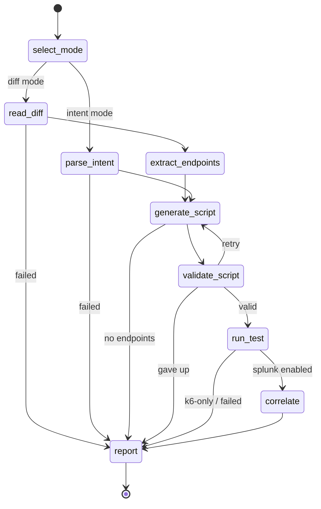

# kassi

An agentic, closed-loop load-testing and observability tool. Point it at a code
change (a git diff) or describe an intent in plain language; it picks the affected
HTTP endpoints, generates a k6 load test, runs it, then correlates the client-side
results with the target service's **server-side telemetry in Splunk** and reports a
combined verdict.

kassi is a [Burr](https://github.com/apache/burr) state machine served over MCP by
[theodosia](https://msradam.github.io/theodosia/). An agent drives the workflow one
`step` at a time. The graph's edges are the only legal moves: an illegal step is
refused with the list of valid next actions, and every step (and every refusal) is
recorded to an immutable, hash-chained ledger. One agent orchestrates **two MCP
servers** as upstreams, neither visible to the driving agent:

- the official [Grafana k6 MCP server](https://github.com/grafana/mcp-k6) validates
  and runs the load test;
- the official [Splunk MCP Server](https://splunkbase.splunk.com/app/7931) runs SPL
  to pull the target's server-side telemetry over the exact test window.

Built for the Splunk Agentic Ops Hackathon (Observability track). See
[`architecture_diagram.md`](architecture_diagram.md) and
[`docs/SUBMISSION.md`](docs/SUBMISSION.md).

## Install

```bash
uv sync
```

kassi delegates all k6 and Splunk work to MCP servers; install them on the host:

```bash
# k6 MCP server (one of)
brew tap grafana/grafana && brew install mcp-k6
docker pull grafana/mcp-k6:latest                   # then set KASSI_K6_DOCKER=1

# Splunk MCP Server: install the app on your Splunk instance, add the
# mcp_tool_execute capability to your role, generate an encrypted token, and copy
# the endpoint from the app. The npx-based stdio bridge needs Node.js.
```

Plan slot-filling uses a local [Ollama](https://ollama.com) model (default
`qwen2.5-coder:7b`). The model only picks from a closed-enum plan; it never writes
k6 source or SPL. If Ollama is unreachable, kassi falls back to a default plan.

The Splunk step is optional: without `KASSI_SPLUNK_MCP_ENDPOINT` + `KASSI_SPLUNK_TOKEN`
set, kassi skips correlation and runs k6-only.

## Usage

Inspect and serve the workflow:

```bash
kassi doctor --runtime     # validate the graph and runtime tool shape
kassi render               # print the state machine
kassi serve                # mount as an MCP server over stdio (both upstreams wired in)
```

Drive it from Claude Code by registering the server:

```bash
claude mcp add --scope=user --transport=stdio kassi -- kassi serve
```

Then ask the agent to run the workflow with the `step` tool, for example:
"Use the kassi step tool. Load test the pet listing endpoint against
http://localhost:8000; the spec is under examples/petstore; correlate with Splunk
index web."

The entry inputs for `select_mode`:

- diff mode: `{"repo_path": "/path/to/repo", "ref": "HEAD~1", "target_base_url": "http://localhost:8000", "splunk_index": "web"}`
- intent mode: `{"repo_path": "/path/with/openapi.json", "intent": "load test the checkout endpoint", "target_base_url": "...", "splunk_index": "web"}`

Review recorded runs:

```bash
kassi sessions ls
kassi sessions show <app-id>
kassi logs <app-id> --refusals
kassi verify <app-id>        # confirm the ledger has not been tampered with
```

## Configuration

| Variable | Default | Purpose |
| --- | --- | --- |
| `OLLAMA_HOST` | `http://localhost:11434` | Ollama endpoint for plan slot-filling |
| `KASSI_MODEL` | `qwen2.5-coder:7b` | Ollama model tag |
| `KASSI_K6_MCP` | `mcp-k6` | command for the native k6 MCP server |
| `KASSI_K6_MCP_ARGS` | (empty) | extra args for the k6 MCP server |
| `KASSI_K6_DOCKER` | unset | if set, run the k6 MCP server via Docker |
| `KASSI_K6_IMAGE` | `grafana/mcp-k6:latest` | Docker image when `KASSI_K6_DOCKER` is set |
| `KASSI_SPLUNK_MCP_ENDPOINT` | unset | streamable-HTTP endpoint of the Splunk MCP Server (e.g. `https://localhost:8089/services/mcp`) |
| `KASSI_SPLUNK_TOKEN` | unset | encrypted MCP token (sent as `Authorization: Bearer`) |
| `KASSI_SPLUNK_MCP_CMD` | `npx` | stdio bridge command (runs `mcp-remote`) |
| `KASSI_SPLUNK_INSECURE` | unset | skip TLS verification in the bridge (local self-signed Splunk only) |
| `THEODOSIA_HOME` | `~/.kassi` | ledger / session store |

`kassi serve` loads these from a `.env` in the project root if present (see
`.env.example`); real environment variables take precedence. Keep `.env` out of git
(it is git-ignored) since the token is a credential.

When running the k6 server in Docker, a target on the host is reachable as
`http://host.docker.internal:<port>` from inside the container.

## How it works



(generated by `kassi render --mermaid`)

- `generate_script` fills a typed `Plan` (test taxonomy, parameterization,
  per-endpoint emphasis) with the LLM, then pure Python composes a single
  self-contained k6 script. A single file is required: the k6 MCP runs one script
  string and cannot resolve local imports, so kassi emits plain `k6/http` calls with
  sample request data derived from the OpenAPI schema.
- `validate_script` and `run_test` call the k6 MCP `validate_script` / `run_script`
  tools through `call_upstream`. `run_test` records the wall-clock test window.
- `correlate` calls the Splunk MCP `splunk_run_query` tool with an SPL rollup scoped
  to that window (override per run with `splunk_spl`), so a client-side regression can
  be tied to server-side errors and latency.
- The validation retry loop is bounded; on give-up kassi reports the failure instead
  of running a broken script. The Splunk step degrades gracefully when unconfigured.

## Development

```bash
uv run ruff format . && uv run ruff check .
uv run pytest
```

The tests use theodosia's `FakeUpstream` for both MCP servers and a fake LLM, so
they run offline with no k6, Splunk, Ollama, or network.

### Local Splunk

[`docs/SPLUNK_SETUP.md`](docs/SPLUNK_SETUP.md) walks through running Splunk Enterprise
locally, seeding sample telemetry, and verifying the integration. The two helper scripts:

```bash
uv run python scripts/seed_splunk.py          # index + HEC + sample data + verify the SPL kassi emits
uv run python scripts/verify_correlate_live.py  # drive the whole FSM; correlate hits live Splunk
```

`scripts/dev_splunk_mcp.py` is a local stdio MCP bridge to Splunk REST, used only to
exercise the correlate path without the official app. Production uses the official Splunk
MCP Server via `KASSI_SPLUNK_MCP_ENDPOINT` + `KASSI_SPLUNK_TOKEN`.

Verified end-to-end against Splunk Enterprise 10.4.0 with the **official Splunk MCP
Server** (Splunkbase 7931, v1.2.0): the full FSM runs, `correlate` calls the official
`splunk_run_query` tool over `mcp-remote`, and a run reporting 200 client-side k6
requests (p95 21.4 ms, 6% failures) correlated to 80 server-side events over the test
window with 7 server errors and 3 client errors. `verify_correlate_live.py` uses the
official server automatically when `.env` is set, else the dev bridge.

## License

Apache-2.0. kassi builds on theodosia (Apache-2.0), Burr (Apache-2.0), and the
official Grafana k6 and Splunk MCP servers.
