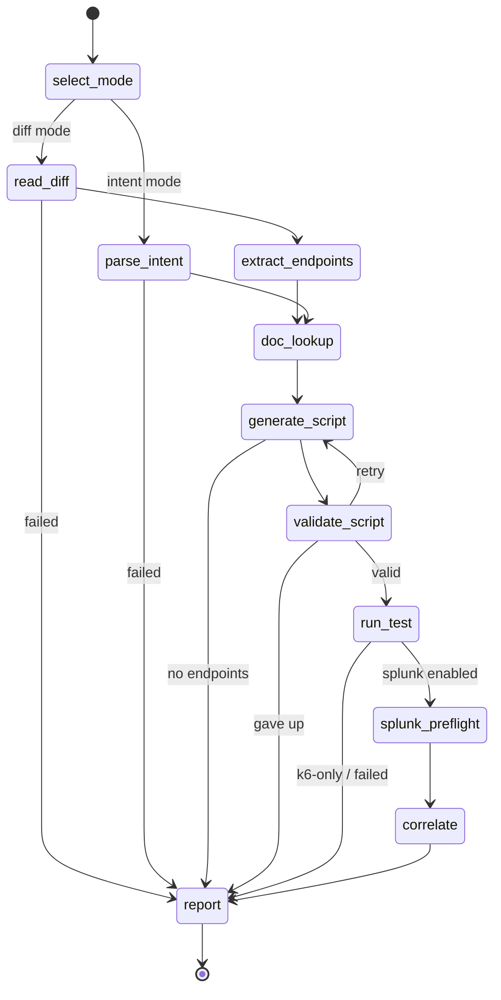

<p align="center"></p>

# kassi

> Divinate your stack's performance.

An agentic, closed-loop load-testing and observability tool. Point it at a code
change (a git diff) or describe an intent in plain language; it picks the affected
HTTP endpoints, generates a k6 load test, runs it, then correlates the client-side
results with the target service's **server-side telemetry in Splunk** and reports a
combined verdict.

Named for the seer who saw what others would not believe, kassi reads a change and
foretells how it behaves under load. The workflow is themed as a tarot draw: the agent
turns one card of the Major Arcana per phase (`kassi arcana` lays out the full spread).

kassi is a [Burr](https://github.com/apache/burr) state machine served over MCP by
[Theodosia](https://msradam.github.io/theodosia/). An agent drives the workflow one
`step` at a time. The graph's edges are the only legal moves: an illegal step is
refused with the list of valid next actions, and every step (and every refusal) is
recorded to an immutable, hash-chained ledger. One agent orchestrates **two MCP
servers** as upstreams, neither visible to the driving agent:

- the official [Grafana k6 MCP server](https://github.com/grafana/mcp-k6) validates
  and runs the load test;
- the official [Splunk MCP Server](https://splunkbase.splunk.com/app/7931) runs SPL
  to pull the target's server-side telemetry over the exact test window.

Built for the Splunk Agentic Ops Hackathon (Observability track). See
[`architecture_diagram.md`](architecture_diagram.md) and
[`docs/SUBMISSION.md`](docs/SUBMISSION.md).


The demo above is recorded from [`docs/demo.tape`](docs/demo.tape) with
[vhs](https://github.com/charmbracelet/vhs): it prints the state machine, then drives the
whole workflow end-to-end (plan filled by Claude Haiku, k6 docs + run, Splunk preflight
and correlation) against a live Splunk.

### Screenshots

| | |
| --- | --- |
|  |  |
| **`kassi render`**: 11 actions, legal edges only | **`kassi arcana`**: a card per phase |
|  |  |
| **`kassi doctor --runtime`**: graph + governance checks | **a full run**: k6 + Splunk correlated, every tool call logged |

## Install

```bash
uv sync
```

kassi delegates all k6 and Splunk work to MCP servers; provide them on the host:

```bash
# k6 MCP server: install k6 2.0+; the server is the built-in `k6 x mcp` subcommand,
# provisioned automatically on first use. Warm the extension cache once up front so
# the first run does not stall while it downloads:
brew install k6                                     # or see https://k6.io/docs/get-started/installation
kassi warm-k6

# Standalone binary instead (set KASSI_K6_CMD=mcp-k6):
#   brew tap grafana/grafana && brew install mcp-k6
# Docker instead (set KASSI_K6_DOCKER=1):
#   docker pull grafana/mcp-k6:latest

# Splunk MCP Server: install the app on your Splunk instance, add the
# mcp_tool_execute capability to your role, generate an encrypted token, and copy
# the endpoint from the app. The npx-based stdio bridge needs Node.js.
```

Plan slot-filling uses a local [Ollama](https://ollama.com) model by default (default
`qwen2.5-coder:7b`). Set `KASSI_LLM=anthropic` to use the Claude Messages API instead
(default `claude-haiku-4-5`, needs `ANTHROPIC_API_KEY`). Either way the model only picks
from a closed-enum plan; it never writes k6 source or SPL, and if the backend is
unreachable kassi falls back to a default plan.

The Splunk step is optional: without `KASSI_SPLUNK_MCP_ENDPOINT` + `KASSI_SPLUNK_TOKEN`
set, kassi skips correlation and runs k6-only.

## Usage

Inspect and serve the workflow:

```bash
kassi doctor --runtime     # validate the graph and runtime tool shape
kassi render               # print the state machine
kassi serve                # mount as an MCP server over stdio (both upstreams wired in)
```

Drive it from Claude Code by registering the server:

```bash
claude mcp add --scope=user --transport=stdio kassi -- kassi serve
```

Then ask the agent to run the workflow with the `step` tool, for example:
"Use the kassi step tool. Load test the pet listing endpoint against
http://localhost:8000; the spec is under examples/petstore; correlate with Splunk
index web."

The entry inputs for `select_mode`:

- diff mode: `{"repo_path": "/path/to/repo", "ref": "HEAD~1", "target_base_url": "http://localhost:8000", "splunk_index": "web"}`
- intent mode: `{"repo_path": "/path/with/openapi.json", "intent": "load test the checkout endpoint", "target_base_url": "...", "splunk_index": "web"}`

Review recorded runs:

```bash
kassi sessions ls
kassi sessions show <app-id>
kassi logs <app-id> --refusals
kassi verify <app-id>        # confirm the ledger has not been tampered with
```

## Configuration

| Variable | Default | Purpose |
| --- | --- | --- |
| `KASSI_LLM` | `ollama` | plan slot-filling backend: `ollama` or `anthropic` |
| `KASSI_MODEL` | `qwen2.5-coder:7b` / `claude-haiku-4-5` | model tag (Ollama tag, or Claude model id when `KASSI_LLM=anthropic`) |
| `OLLAMA_HOST` | `http://localhost:11434` | Ollama endpoint (when `KASSI_LLM=ollama`) |
| `ANTHROPIC_API_KEY` | unset | Claude API key (when `KASSI_LLM=anthropic`) |
| `KASSI_K6_CMD` | `k6 x mcp` | command line for the k6 MCP server (set to `mcp-k6` for the standalone binary) |
| `KASSI_K6_DOCKER` | unset | if set, run the k6 MCP server via Docker |
| `KASSI_K6_IMAGE` | `grafana/mcp-k6:latest` | Docker image when `KASSI_K6_DOCKER` is set |
| `KASSI_SPLUNK_MCP_ENDPOINT` | unset | streamable-HTTP endpoint of the Splunk MCP Server (e.g. `https://localhost:8089/services/mcp`) |
| `KASSI_SPLUNK_TOKEN` | unset | encrypted MCP token (sent as `Authorization: Bearer`) |
| `KASSI_SPLUNK_MCP_CMD` | `npx` | stdio bridge command (runs `mcp-remote`) |
| `KASSI_SPLUNK_INSECURE` | unset | skip TLS verification in the bridge (local self-signed Splunk only) |
| `THEODOSIA_HOME` | `~/.kassi` | ledger / session store |

`kassi serve` loads these from a `.env` in the project root if present (see
`.env.example`); real environment variables take precedence. Keep `.env` out of git
(it is git-ignored) since the token is a credential.

When running the k6 server in Docker, a target on the host is reachable as
`http://host.docker.internal:<port>` from inside the container.

## How it works



(generated by `kassi render --mermaid`)

- `doc_lookup` consults the k6 MCP documentation tools (`list_sections` +
  `get_documentation`) for the constructs kassi emits (HTTP requests, thresholds,
  checks, scenarios) and records version-grounded citations. It is non-blocking:
  generation proceeds even if the docs are unavailable.
- `generate_script` fills a typed `Plan` (test taxonomy, parameterization,
  per-endpoint emphasis) with the LLM, then pure Python composes a single
  self-contained k6 script. A single file is required: the k6 MCP runs one script
  string and cannot resolve local imports, so kassi emits plain `k6/http` calls with
  sample request data derived from the OpenAPI schema.
- `validate_script` and `run_test` call the k6 MCP `validate_script` / `run_script`
  tools through `call_upstream`. `run_test` records the wall-clock test window.
- `splunk_preflight` verifies the target index exists and captures its event count,
  sourcetypes, and the Splunk version (`splunk_get_info` / `splunk_get_index_info` /
  `splunk_get_metadata`) before correlating. It catches the "wrong index, zero rows"
  failure early and is non-blocking.
- `correlate` calls the Splunk MCP `splunk_run_query` tool with an SPL rollup scoped
  to that window (override per run with `splunk_spl`), so a client-side regression can
  be tied to server-side errors and latency.
- Every upstream tool call is logged to `mcp_provenance` in the report, so the run
  shows exactly which k6 and Splunk MCP tools the agent invoked. The validation retry
  loop is bounded; on give-up kassi reports the failure instead of running a broken
  script. Both MCP-native phases degrade gracefully when a tool or server is absent.

## The Major Arcana

Each phase is a card the agent turns. Run `kassi arcana` for the full spread.

| Card | Phase | Omen |
| --- | --- | --- |
| The Fool (0) | `select_mode` | the querent sets out: diff or intent |
| The High Priestess (II) | `read_diff` | hidden knowledge read from the diff |
| The Emperor (IV) | `extract_endpoints` | order from change: the routes are named |
| The Empress (III) | `parse_intent` | intuition reads the intent into endpoints |
| The Hierophant (V) | `doc_lookup` | doctrine consulted: the k6 docs ground the rite |
| The Magician (I) | `generate_script` | as above, so below: the load test is manifested |
| Justice (XI) | `validate_script` | the script is weighed; the unworthy is turned back |
| The Tower (XVI) | `run_test` | load strikes the structure; what breaks is revealed |
| The Hermit (IX) | `splunk_preflight` | a lantern into the index before the reading |
| The Lovers (VI) | `correlate` | client and server joined over one window |
| Judgement (XX) | `report` | the verdict is spoken and sealed to the ledger |
| The World (XXI) | the ledger | the cycle closes: an immutable, hash-chained record |
| The Devil (XV) | a refusal | you are bound: only the legal moves are permitted |

## Case study

Verified end-to-end against **Splunk Enterprise 10.4.0** with the **official Splunk MCP
Server** (Splunkbase 7931, v1.2.0). One reproducible command drives the whole FSM from
the petstore intent through `report`, with `correlate` calling the official
`splunk_run_query` tool over the `mcp-remote` bridge:

```console
$ uv run python scripts/verify_correlate_live.py
splunk upstream: OFFICIAL Splunk MCP Server (from .env)
... splunk_preflight_done exists=True index=web sourcetypes=1
... correlate_done rows=1 status=ok
verdict:          passed
splunk_enabled:   True
k6 http_reqs:     200
correlation SPL:  search index=web earliest=1781191533 latest=1781191537 | stats ...
correlation OK:   True
server-side rows: [{"total_events": "80", "server_errors": "7",
                    "client_errors": "3", "avg_response_ms": "21.25"}]
k6 doc refs:      ['using-k6/http-requests', 'using-k6/thresholds',
                   'using-k6/checks', 'using-k6/scenarios']
splunk preflight: index=web exists=True events=720 sourcetypes=['access_json'] splunk=10.4.0
mcp tool calls:   ['k6.list_sections=ok', 'k6.get_documentation=ok' (x4),
                   'k6.validate_script=ok', 'k6.run_script=ok',
                   'splunk.splunk_get_info=ok', 'splunk.splunk_get_index_info=ok',
                   'splunk.splunk_get_metadata=ok', 'splunk.splunk_run_query=ok']
```

What this proves: one agent drove every workflow step legally and orchestrated
**11 tool calls across both MCP servers**. `doc_lookup` grounded generation in the live
k6 docs; `splunk_preflight` confirmed the `web` index against the **live** official
Splunk MCP Server (720 events, `access_json` sourcetype, Splunk 10.4.0); `run_test`
returned 200 client-side k6 requests (p95 21.4 ms, 6% failed); and `correlate` queried
Splunk with SPL scoped to the exact test window and read back the server-side truth,
80 events with 7 5xx and 3 4xx at 21.25 ms average. The client-side failure rate is
explained by server-side errors, correlated automatically over one window, with every
upstream call recorded to the ledger and surfaced in `mcp_provenance`.

In this reproduction the k6 client metrics are canned so the k6 MCP server need not be
installed, while telemetry is ingested into live Splunk over the run window and the
Splunk leg runs through the real official MCP Server. Set `.env` and the script uses the
official server automatically; otherwise it falls back to the local dev bridge.

## Development

```bash
uv run ruff format . && uv run ruff check .
uv run pytest
```

The tests use Theodosia's `FakeUpstream` for both MCP servers and a fake LLM, so
they run offline with no k6, Splunk, Ollama, or network.

### Local Splunk

[`docs/SPLUNK_SETUP.md`](docs/SPLUNK_SETUP.md) walks through running Splunk Enterprise
locally, seeding sample telemetry, and verifying the integration. The two helper scripts:

```bash
uv run python scripts/seed_splunk.py          # index + HEC + sample data + verify the SPL kassi emits
uv run python scripts/verify_correlate_live.py  # drive the whole FSM; correlate hits live Splunk
```

`scripts/dev_splunk_mcp.py` is a local stdio MCP bridge to Splunk REST, used only to
exercise the correlate path without the official app. Production uses the official Splunk
MCP Server via `KASSI_SPLUNK_MCP_ENDPOINT` + `KASSI_SPLUNK_TOKEN`. See the [Case
study](#case-study) for a verified run.

## License

Apache-2.0. kassi builds on Theodosia (Apache-2.0), Burr (Apache-2.0), and the
official Grafana k6 and Splunk MCP servers.

Tarot icon by [Eucalyp](https://thenounproject.com/Eucalyp/) from the Noun Project,
[CC BY 3.0](https://creativecommons.org/licenses/by/3.0/).
