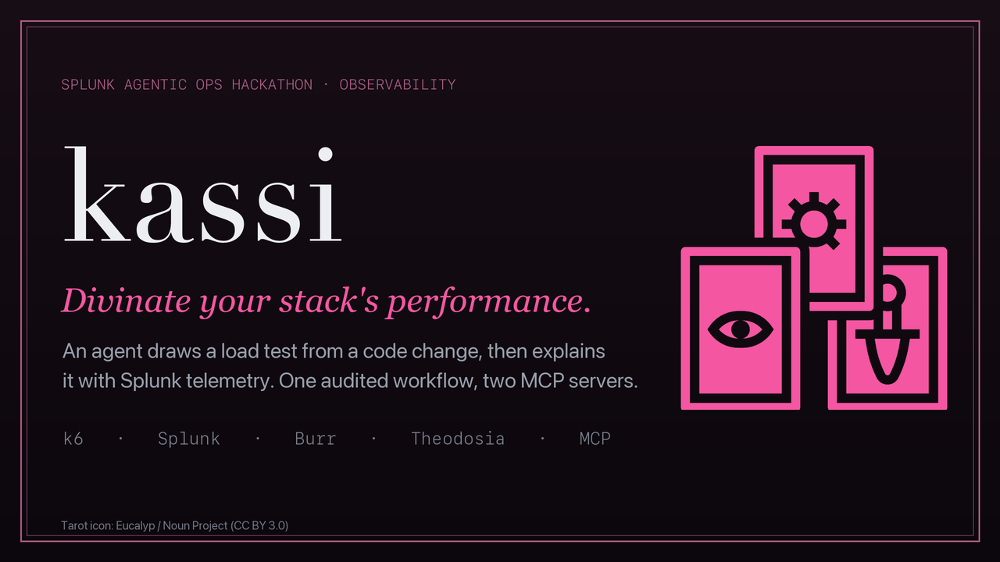
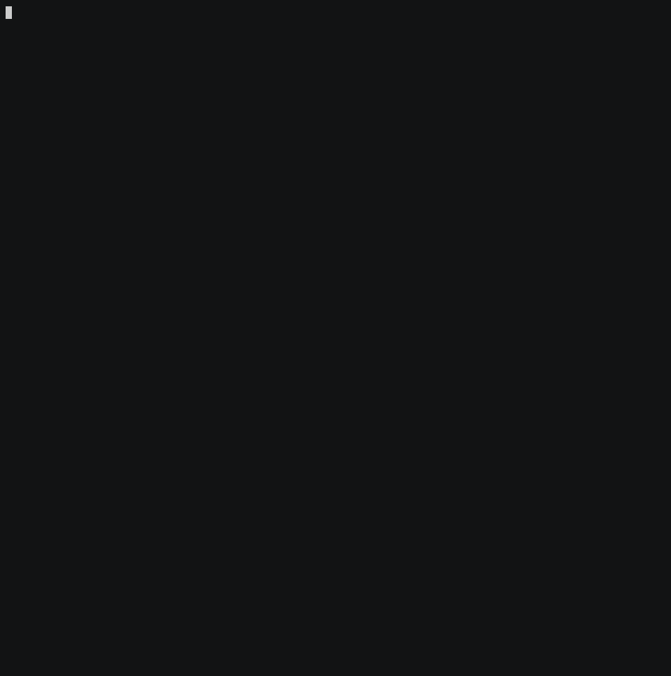
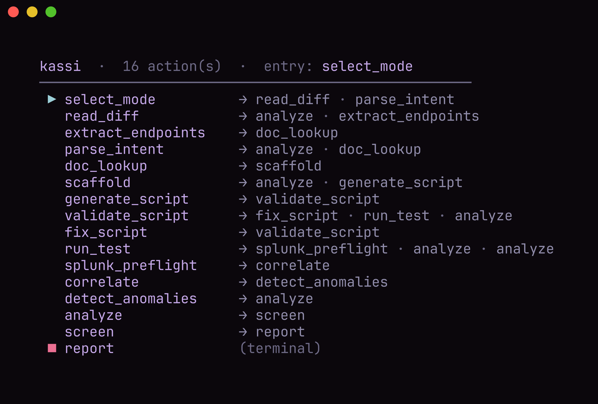
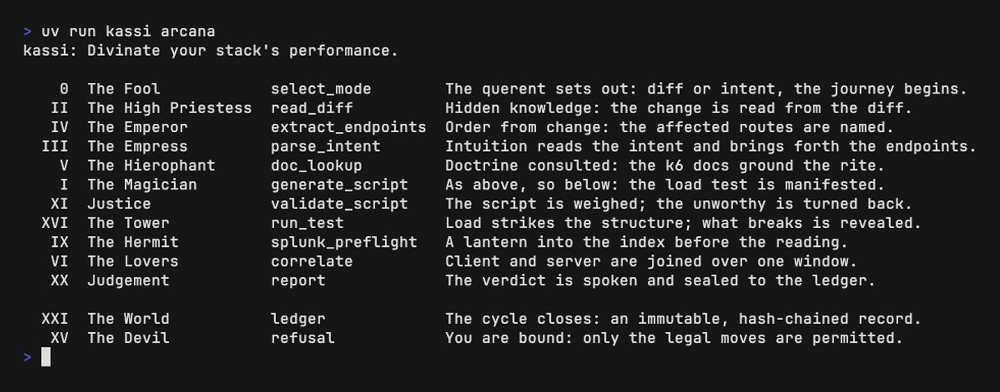
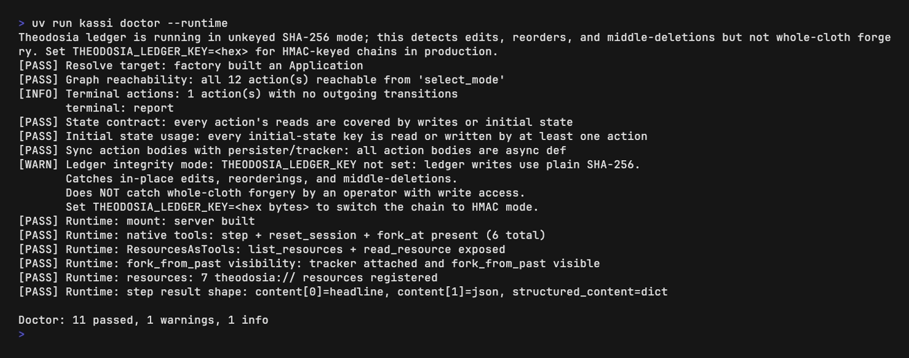
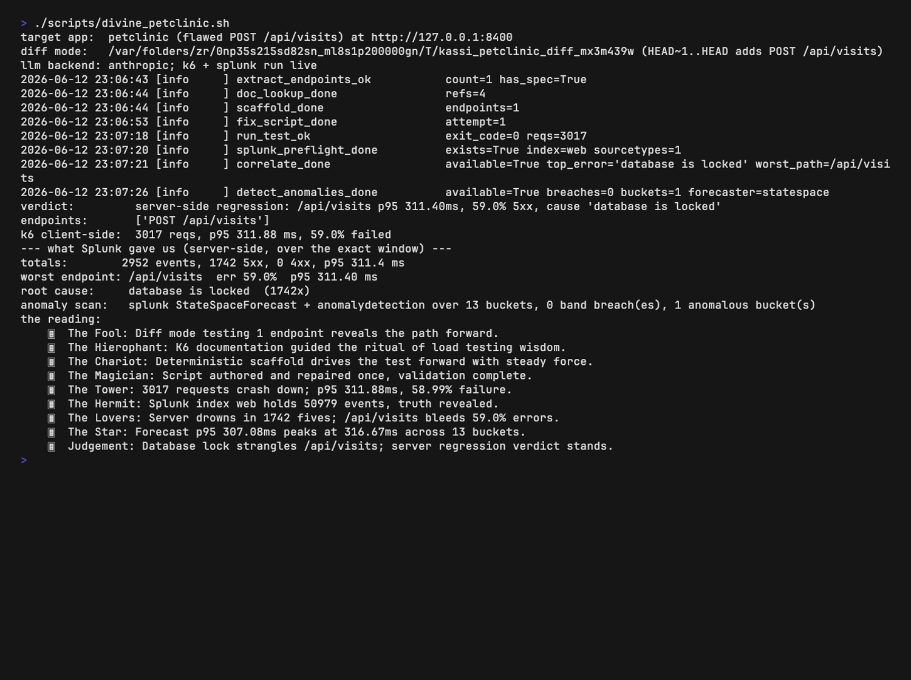
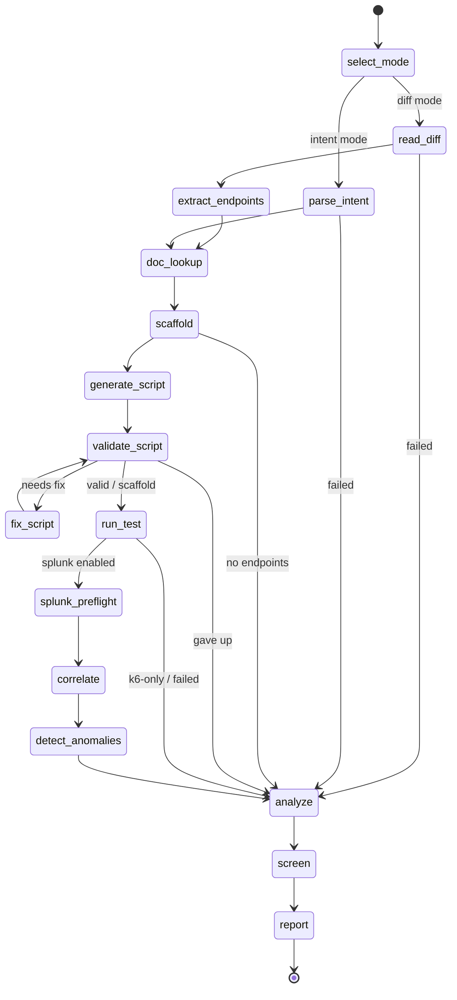
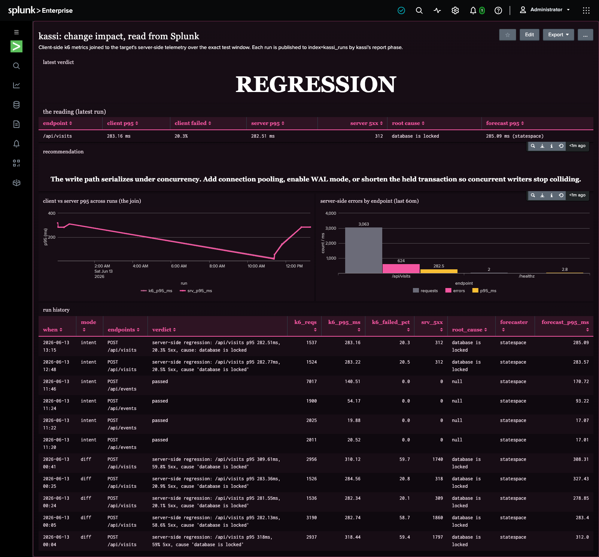

<p align="center"></p>

# kassi

> Divines disaster, crafts the cure.

Closed-loop observability, driven by change. Roughly 80% of production outages are
self-inflicted: Gartner attributes unplanned downtime to people and process, not technology, and
change is the single biggest cause. The warning usually exists, but you can't prove it before the
change ships.

kassi closes that loop. Point it at a code change (a git diff) or a plain-language intent, and it
load-tests the affected endpoints with real traffic through the Grafana k6 MCP server, reads the
target's server-side telemetry back from Splunk over the exact window, and explains what the change
did and why. You get a cited root-cause analysis with the evidence, an ML forecast of the trend, a
remediation diff that fixes the cause, and a verdict published to a Splunk dashboard. A change comes
in, a change that fixes it goes out, every step sealed to an auditable, hash-chained ledger, so the
prophecy comes with proof and a patch.

kassi is named for Kassandra, who foresaw what others would not believe. It reads a change and
foretells how it behaves under load. The workflow is themed as a tarot draw: the agent turns one
card of the Major Arcana per phase (`kassi arcana` lays out the full spread).

kassi is a [Burr](https://github.com/apache/burr) state machine served over MCP by
[Theodosia](https://msradam.github.io/theodosia/). An agent drives the workflow one
`step` at a time. The graph's edges are the only legal moves: an illegal step is
refused with the list of valid next actions, and every step (and every refusal) is
recorded to an immutable, hash-chained ledger. One agent orchestrates **two MCP
servers** as upstreams, neither visible to the driving agent:

- the official [Grafana k6 MCP server](https://github.com/grafana/mcp-k6) validates
  and runs the load test;
- the official [Splunk MCP Server](https://splunkbase.splunk.com/app/7931) runs SPL
  to pull the target's server-side telemetry over the exact test window.

Built for the Splunk Agentic Ops Hackathon (Observability track). See
[`DEVPOST.md`](DEVPOST.md) for the submission writeup and
[`architecture_diagram.md`](architecture_diagram.md) for the design.

<p align="center"></p>

The demo above is a recorded end-to-end run: it prints the state machine, then drives the
whole workflow (script + analysis from the configured model, k6 docs + run, Splunk preflight
and correlation) against a live Splunk.

### Screenshots

| | |
| --- | --- |
|  |  |
| **`kassi render`**: the full state machine, legal edges only | **`kassi arcana`**: a card per phase |
|  |  |
| **`kassi doctor --runtime`**: graph + governance checks | **a full run**: k6 + Splunk correlated, every tool call logged |

## Install

```bash
uv sync
```

kassi delegates all k6 and Splunk work to MCP servers; provide them on the host:

```bash
# k6 MCP server: install k6 2.0+; the server is the built-in `k6 x mcp` subcommand,
# provisioned automatically on first use. Warm the extension cache once up front so
# the first run does not stall while it downloads:
brew install k6                                     # or see https://k6.io/docs/get-started/installation
kassi warm-k6

# Standalone binary instead (set KASSI_K6_CMD=mcp-k6):
#   brew tap grafana/grafana && brew install mcp-k6
# Docker instead (set KASSI_K6_DOCKER=1):
#   docker pull grafana/mcp-k6:latest

# Splunk MCP Server: install the app on your Splunk instance, add the
# mcp_tool_execute capability to your role, generate an encrypted token, and copy
# the endpoint from the app. The npx-based stdio bridge needs Node.js.
```

The model authors the k6 script (on top of the deterministic scaffold), writes a cited
analysis of the result, and narrates the run as a tarot reading; it never writes SPL. The
backend is pluggable behind one `LLM` interface, selected by `KASSI_LLM`: a local
[Ollama](https://ollama.com) model (e.g. `granite4.1:8b`, whose chat template natively grounds the
analysis on the run's evidence documents so the writeup stays to the numbers kassi measured), or a
frontier model over the **Claude Agent SDK** (`KASSI_LLM=claude_agent`, which uses a logged-in
Claude Code session rather than an API key). If the backend is unreachable, kassi runs the
deterministic scaffold and a deterministic analysis, so a run never fails for lack of a model.

The model is pluggable, both for the per-phase work and for *driving* the FSM (`kassi pilot`, or
any MCP client). The orchestration, the audited Burr graph over MCP, is model-neutral, so the
architecture scales **with** the model rather than depending on one: the same harness runs the whole
loop (drive, write, audit) on a local 8B with no cloud dependency, and scales up to a frontier model
unchanged.

The Splunk step is optional: without `KASSI_SPLUNK_MCP_ENDPOINT` + `KASSI_SPLUNK_TOKEN`
set, kassi skips correlation and runs k6-only.

## Usage

Inspect and serve the workflow:

```bash
kassi doctor --runtime     # validate the graph and runtime tool shape
kassi render               # print the state machine
kassi serve                # mount as an MCP server over stdio (both upstreams wired in)
```

Drive it locally, no cloud agent. `kassi pilot` lets a local open model
drive the FSM step by step: it reads the reachable actions and calls `step` for each phase
itself, doing the per-phase work as it goes (the `screen` phase hands off to an independent auditor).
Driver, writer, and auditor are all the local model:

```bash
kassi pilot --intent "load test the pet listing endpoint" \
  --repo-path examples/petstore --target-base-url http://localhost:8000 --splunk-index web
# or diff mode: kassi pilot --repo-path /path/to/repo --ref HEAD~1 --splunk-index web
```

Run it in the background, triggered on diff detection. `kassi watch` polls a repo's git HEAD and,
when a new commit changes an HTTP endpoint, drives the whole workflow in diff mode against that
change, then prints the verdict and a proposed fix and publishes the run to Splunk, hands-free: a
change comes in, a verdict goes out, so the regression is caught at commit time, not at 2am.

```bash
kassi watch --repo-path /path/to/repo --target-base-url http://localhost:8000 --splunk-index web
# one-shot for a post-commit hook or CI: kassi watch --once --repo-path . --target-base-url ...
```

Or drive it from Claude Code (or any MCP client) by registering the server:

```bash
claude mcp add --scope=user --transport=stdio kassi -- kassi serve
```

Then ask the agent to run the workflow with the `step` tool, for example:
"Use the kassi step tool. Load test the pet listing endpoint against
http://localhost:8000; the spec is under examples/petstore; correlate with Splunk
index web."

The entry inputs for `select_mode`:

- diff mode: `{"repo_path": "/path/to/repo", "ref": "HEAD~1", "target_base_url": "http://localhost:8000", "splunk_index": "web"}`
- intent mode: `{"repo_path": "/path/with/openapi.json", "intent": "load test the checkout endpoint", "target_base_url": "...", "splunk_index": "web"}`

Review recorded runs:

```bash
kassi sessions ls
kassi sessions show <app-id>
kassi logs <app-id> --refusals
kassi verify <app-id>        # confirm the ledger has not been tampered with
```

## Configuration

| Variable | Default | Purpose |
| --- | --- | --- |
| `KASSI_LLM` | `ollama` | model backend: `ollama` (local), `claude_agent` (Claude via the Claude Code session, no API key), or `anthropic` (Claude Messages API) |
| `KASSI_MODEL` | `granite4.1:8b` / `sonnet` | model tag: an Ollama tag, or a Claude model alias/id for the Claude backends |
| `OLLAMA_HOST` | `http://localhost:11434` | Ollama endpoint (point at the host running the local model, e.g. a LAN box) |
| `ANTHROPIC_API_KEY` | unset | Claude API key (only for `KASSI_LLM=anthropic`; `claude_agent` uses the logged-in Claude Code session instead) |
| `KASSI_K6_CMD` | `k6 x mcp` | command line for the k6 MCP server (set to `mcp-k6` for the standalone binary) |
| `KASSI_K6_DOCKER` | unset | if set, run the k6 MCP server via Docker |
| `KASSI_K6_IMAGE` | `grafana/mcp-k6:latest` | Docker image when `KASSI_K6_DOCKER` is set |
| `KASSI_SPLUNK_MCP_ENDPOINT` | unset | streamable-HTTP endpoint of the Splunk MCP Server (e.g. `https://localhost:8089/services/mcp`) |
| `KASSI_SPLUNK_TOKEN` | unset | encrypted MCP token (sent as `Authorization: Bearer`) |
| `KASSI_SPLUNK_MCP_CMD` | `npx` | stdio bridge command (runs `mcp-remote`) |
| `KASSI_SPLUNK_INSECURE` | unset | skip TLS verification in the bridge (local self-signed Splunk only) |
| `THEODOSIA_HOME` | `~/.kassi` | ledger / session store |

`kassi serve` loads these from a `.env` in the project root if present (see
`.env.example`); real environment variables take precedence. Keep `.env` out of git
(it is git-ignored) since the token is a credential.

When running the k6 server in Docker, a target on the host is reachable as
`http://host.docker.internal:<port>` from inside the container.

## How it works



(generated by `kassi render --mermaid`)

- `doc_lookup` consults the k6 MCP documentation tools (`list_sections` +
  `get_documentation`) for the constructs kassi emits (HTTP requests, thresholds,
  checks, scenarios) and records version-grounded citations. It is non-blocking:
  generation proceeds even if the docs are unavailable.
- `scaffold` composes a deterministic, self-contained k6 baseline from the OpenAPI
  schema (per-endpoint requests with sample bodies, the baked base URL, load options).
  No model. A single file is required: the k6 MCP runs one script string and cannot
  resolve local imports, so kassi emits plain `k6/http` calls. This scaffold is the
  known-good fallback.
- `generate_script` has the model author the final script on top of the scaffold,
  guided by k6's own `generate_script` MCP prompt and `best_practices` resource.
- `validate_script` gates the script at the k6 MCP `validate_script` tool. On failure it
  routes to `fix_script`, an explicit correction loop in the state machine: `fix_script`
  repairs the script from the real k6 error (stderr + the server's structured issues and
  suggestions) and loops back to validation. The loop is bounded by `MAX_FIX_ATTEMPTS`;
  on give-up it runs the deterministic scaffold rather than fail. So an unvalidated script
  never reaches `run_test`.
- `run_test` executes the validated script via the k6 MCP `run_script` tool (passing VUs
  and duration, which the tool needs since it ignores the script's own options) and
  records the wall-clock test window.
- `splunk_preflight` verifies the target index exists and captures its event count,
  sourcetypes, and the Splunk version (`splunk_get_info` / `splunk_get_index_info` /
  `splunk_get_metadata`) before correlating. It catches the "wrong index, zero rows"
  failure early and is non-blocking.
- `correlate` runs four windowed SPL queries through the Splunk MCP `splunk_run_query`
  tool to answer what k6 client-side cannot: a rollup (overview), a timeline (when it
  degraded), a by-endpoint breakdown (which route degraded), and the dominant server-side
  error (why). It synthesizes the actionable findings, so the run can say "POST /api/visits
  regressed: 59% 5xx, p95 318ms vs 2ms baseline, cause 'database is locked'", which the k6
  summary alone never shows. Override the rollup per run with `splunk_spl`.
- `detect_anomalies` runs Splunk's own ML over the same window through the same
  `splunk_run_query` tool: the **AI Toolkit's `StateSpaceForecast`** algorithm forecasts the
  latency band (falling back to the core `predict` command when the toolkit's Python for
  Scientific Computing add-on is absent) and `anomalydetection` flags statistically outlying
  buckets. The saturation onset is found by Splunk's ML, not by a fixed threshold in kassi,
  and the forecast band and anomalous buckets fold into the verdict. Non-blocking, like the
  other Splunk phases.
- `analyze` is the **writer** phase: the model produces, from the recorded facts, a practical
  **analysis** (summary, affected endpoints, root cause, evidence with a source citation per
  fact, and a recommendation), grounded on the evidence documents so it stays to the measured
  numbers; and, in diff mode, a **proposed remediation** (a minimal unified diff that fixes the
  root cause, written from the diff that introduced it) for human review. Both fall back to
  deterministic text when the model is absent.
- `screen` is the **auditor** phase: a separate **independent auditor model** (Granite Guardian
  with the local backend, or the frontier model in audit mode) judges whether the analysis is
  grounded in the evidence it cites (any claim unsupported by or contradicting the telemetry), and
  the pass/fail is sealed to the report. The writer is checked by a second model, not trusted on its
  own word. Non-blocking: skipped when the auditor is off.
- `report` assembles the combined client plus server verdict and the tarot **narration** (one
  line per phase, deterministic omens when the model is absent). Every upstream tool call is
  logged to `mcp_provenance`. The run is published to Splunk twice over: a `kassi:run` summary,
  and the agent's own **state-machine walk** as one `kassi:step` event per phase (keyed by Burr's
  `app_id`), so the dashboard shows not just what the change did but how the agent reached the
  verdict. The model authors only the script, the analysis, the remediation, and the narration,
  never the SPL.

## The Major Arcana

Each phase is a card the agent turns. Run `kassi arcana` for the full spread.

| Card | Phase | Omen |
| --- | --- | --- |
| The Fool (0) | `select_mode` | the querent sets out: diff or intent |
| The High Priestess (II) | `read_diff` | hidden knowledge read from the diff |
| The Emperor (IV) | `extract_endpoints` | order from change: the routes are named |
| The Empress (III) | `parse_intent` | intuition reads the intent into endpoints |
| The Hierophant (V) | `doc_lookup` | doctrine consulted: the k6 docs ground the rite |
| The Chariot (VII) | `scaffold` | the vehicle is assembled from the spec: a runnable scaffold takes shape |
| The Magician (I) | `generate_script` | as above, so below: the agent authors the script atop the scaffold |
| Justice (XI) | `validate_script` | the script is weighed; the unworthy is turned back |
| Temperance (XIV) | `fix_script` | the flawed draft is tempered against k6's judgment until it holds |
| The Tower (XVI) | `run_test` | load strikes the structure; what breaks is revealed |
| The Hermit (IX) | `splunk_preflight` | a lantern into the index before the reading |
| The Lovers (VI) | `correlate` | client and server joined over one window |
| The Star (XVII) | `detect_anomalies` | Splunk's own forecast is cast; where the load breaches the band is revealed |
| The Sun (XIX) | `analyze` | the reading is made plain: cause, evidence, and the cure laid bare |
| The Hanged Man (XII) | `screen` | seen again through another's eyes: the reading is judged grounded, or not |
| Judgement (XX) | `report` | the verdict is spoken and sealed to the ledger |
| The World (XXI) | the ledger | the cycle closes: an immutable, hash-chained record |
| The Devil (XV) | a refusal | you are bound: only the legal moves are permitted |

## Case study

Verified end-to-end against **Splunk Enterprise 10.4.0** with the **official Splunk MCP
Server** (Splunkbase 7931, v1.2.0), called live at runtime. `scripts/verify_petclinic.py`
drives the whole FSM with **nothing canned**, in **diff mode**: a throwaway git repo holds a
healthy petclinic baseline plus a second commit that adds `POST /api/visits`, so kassi picks
the changed endpoint from the diff, runs **real k6** through the k6 MCP server against it,
reads the server-side regression back from Splunk through the four `correlate` queries, and
runs the AI Toolkit's `StateSpaceForecast` (with `predict` as the fallback) plus
`anomalydetection` over the same window in `detect_anomalies`, all on the official
`splunk_run_query` tool.

```console
$ KASSI_LLM=claude_agent uv run python scripts/verify_petclinic.py
target app:  petclinic (flawed POST /api/visits) at http://127.0.0.1:8400
diff mode:   HEAD~1..HEAD adds POST /api/visits         # kassi tests exactly the changed endpoint
... extract_endpoints_ok count=1                        # one new route, read from the diff
... validation failed (attempt 0): Unexpected token ILLEGAL ... Missing k6 module imports
... fix_script_done attempt=1                           # repaired from the real k6 error
... run_test_ok exit_code=0 reqs=2937
verdict:         server-side regression: /api/visits p95 318.44ms, 59.4% 5xx, cause 'database is locked'
endpoints:       POST /api/visits
k6 client-side:  2937 reqs, p95 318.44 ms, 59.4% failed
worst endpoint:  /api/visits  59.4% errs  p95 318.44 ms
root cause:      database is locked  (1797x)
anomaly scan:    splunk StateSpaceForecast + anomalydetection over 13 buckets, 1 anomalous bucket
mcp tool calls:  k6.{list_sections, get_documentation x4, generate_script(prompt),
                     validate_script x2, run_script}
                 splunk.{get_info, get_index_info, get_metadata, run_query x6}
the reading:
    🂠  The Fool: Diff mode revealed 1 endpoint under scrutiny.
    🂠  The Magician: Script authored, repaired once, validated successfully.
    🂠  The Tower: 2937 requests executed; p95 318.44 ms, 59.4% failure rate.
    🂠  The Lovers: /api/visits worst at 59.4% errors, database locked 1797 times.
    🂠  The Star: StateSpaceForecast forecast p95 ~312ms; anomalydetection flagged the anomalous bucket.
    🂠  Judgement: Server regression confirmed: /api/visits, database lock root cause.
```

What this proves, all at runtime against live Splunk: kassi read the new `POST /api/visits`
from the git diff (the healthy GET routes are untouched by the change, so it tests exactly
the new endpoint), the model authored a script that failed k6 validation, the `fix_script`
loop repaired it from the real k6 error and re-validated, real k6 drove 2937 requests, the
four `correlate` queries on the official Splunk MCP Server isolated the new endpoint
(`/api/visits` at 59.4% 5xx) and named the root cause k6 cannot see ("database is locked"),
and the AI Toolkit's `StateSpaceForecast` forecast the latency band while `anomalydetection`
flagged the anomalous bucket statistically.
Every upstream call is on the hash-chained ledger and in `mcp_provenance`. See
[`docs/SPLUNK_SETUP.md`](docs/SPLUNK_SETUP.md) for the full setup.

For a lighter reproduction without a target app, `scripts/verify_correlate_live.py` cans the
k6 metrics and ingests sample telemetry, but still queries the real official Splunk MCP Server.

## Demo scenarios

`examples/` ships five target apps, each a healthy baseline plus one "new" endpoint with a
distinct load-induced failure, so the suite spans the common regression classes (not just one
trick). Each ships the same `access_json` telemetry to Splunk, so kassi correlates them
unchanged; the failure only appears under concurrency.

| App | New endpoint | Failure signature | What it exercises |
| --- | --- | --- | --- |
| `petclinic` | `POST /api/visits` | 5xx, constant, `database is locked` | correlation isolates the root-cause error |
| `storefront` | `POST /api/checkout` | latency, **0 errors** (N+1 over a shared connection) | server-side `db_time`, invisible to the client error rate |
| `feed` | `POST /api/events` | latency **rising over the run** (unbounded recompute) | `detect_anomalies`: the forecast band and anomalydetection catch the trend |
| `gateway` | `GET /api/quote` | **4xx** 429 throttling (too-tight rate limit) | client-vs-server error split: "throttled, not broken" |
| `orders` | `POST /api/order` | latency **+ 504 mix** (downstream cascade) | dependency root cause, resilience recommendation |

Run any of them end-to-end (starts the app, real k6, live Splunk, the grounded analysis):

```bash
uv run python scripts/verify_scenario.py feed   # or petclinic | storefront | gateway | orders
```

`petclinic` is also the headline diff-mode run below.

## Benchmark

`kassi-bench` scores kassi against ground truth: 80 live runs over five change-induced fault classes
(5xx regression, two latency degradations, 4xx throttling, a 504 cascade) plus three healthy
controls, ten reps each, with the model authoring the load test and analysis and the verdict computed
deterministically from Splunk. Across the faults kassi detects 90%, localizes 92%, classifies 90%,
and names the root cause 95%; the controls hold a 0% false-alarm rate. A second suite,
`kassi-bench-ext`, runs kassi against go-httpbin (a third-party app it never instrumented, observed
through a generic access-log proxy) and scores 15/15. Against the canonical academic benchmark
**RCAEval RE3** (code-level faults in Online Boutique and Train Ticket), kassi's diagnosis engine
localizes the root-cause service at top-1 in **81%** of 57 cases (90% on Online Boutique) and within
top-3 in **100%**, competitive with the strongest published methods and well ahead of the classical
baselines. Between them the suites found and fixed three
real bugs: a missing throttling branch, a too-low latency floor, and a validation step that read a
crossed k6 threshold as a broken script. Full methodology and tables:
[`docs/benchmark/BENCHMARK.md`](docs/benchmark/BENCHMARK.md).

```bash
uv run python scripts/benchmark.py --reps 10            # demo suite -> docs/benchmark/results.json
docker run -d -p 8600:8080 ghcr.io/mccutchen/go-httpbin
uv run python scripts/benchmark_external.py --reps 5    # external suite (go-httpbin via the proxy)
uv run python scripts/benchmark_rcaeval.py --systems OB,TT   # canonical RCAEval RE3 (after download)
uv run python scripts/benchmark_report.py               # regenerates the report
```

## Dashboard

<p align="center"></p>

The `report` phase publishes each run to `index=kassi_runs` over HEC: a `kassi:run` summary
(verdict, k6 client metrics, the server-side correlation, the forecast, the root cause) and,
because the agent's own execution is telemetry too, one `kassi:step` event per state-machine
phase, the agent's walk from The Fool to Judgement, keyed by Burr's `app_id`. So the dashboard
shows both what the change did and how the agent reached the verdict. The agent stays CLI/MCP;
Splunk is the reporting surface. Provision it once:

```bash
uv run python scripts/setup_dashboard.py   # creates the index, an HEC token, and the dashboard
# paste the printed KASSI_HEC_TOKEN into .env, then every run self-publishes
```

The dashboard (`docs/dashboard/kassi_overview.xml`) shows the latest verdict, the agent's
state-machine walk for that run (each phase, its outcome, and the tool calls it made), step
outcomes across runs, k6 vs server-side p95, p95 across runs, server-side errors by endpoint,
and a run-history table. Gated on `KASSI_HEC_TOKEN`: with it unset, runs simply don't publish.

## Development

```bash
uv run ruff format . && uv run ruff check .
uv run pytest
```

The tests use Theodosia's `FakeUpstream` for both MCP servers and a fake LLM, so
they run offline with no k6, Splunk, Ollama, or network.

### Local Splunk

[`docs/SPLUNK_SETUP.md`](docs/SPLUNK_SETUP.md) walks through running Splunk Enterprise
locally, seeding sample telemetry, and verifying the integration. The two helper scripts:

```bash
uv run python scripts/seed_splunk.py            # index + HEC + sample data + verify the SPL kassi emits
uv run python scripts/verify_correlate_live.py  # drive the whole FSM; correlate hits live Splunk
KASSI_LLM=claude_agent uv run python scripts/verify_petclinic.py  # the real-app root-cause demo
```

`verify_petclinic.py` is the headline demo, nothing canned: it starts the
[`examples/petclinic`](examples/petclinic) app (a healthy baseline plus a new
`POST /api/visits` with a SQLite write-lock flaw that only bites under load, shipping
access logs to Splunk's HEC), runs real k6 through the k6 MCP server, and reads the
server-side regression back from Splunk: which endpoint, how bad, and the "database is
locked" root cause k6 alone can't see.

`scripts/dev_splunk_mcp.py` is a local stdio MCP bridge to Splunk REST, used only to
exercise the correlate path without the official app. Production uses the official Splunk
MCP Server via `KASSI_SPLUNK_MCP_ENDPOINT` + `KASSI_SPLUNK_TOKEN`. See the [Case
study](#case-study) for a verified run.

## License

Apache-2.0. kassi builds on Theodosia (Apache-2.0), Burr (Apache-2.0), and the
official Grafana k6 and Splunk MCP servers.

Tarot icon by [Eucalyp](https://thenounproject.com/Eucalyp/) from the Noun Project,
[CC BY 3.0](https://creativecommons.org/licenses/by/3.0/).
