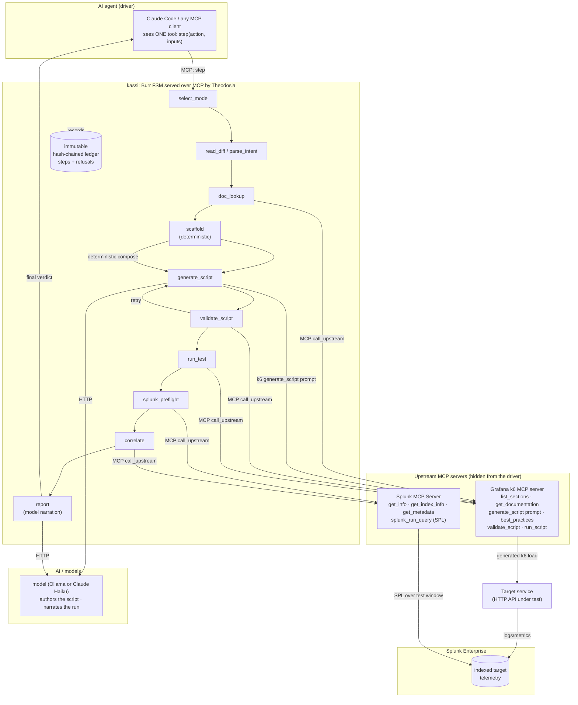

# kassi architecture

kassi is one AI agent that orchestrates two MCP servers through a durable,
state-machine-enforced workflow, then correlates client-side load-test results with
server-side telemetry in Splunk.

## System diagram



## How the application interacts with Splunk

After the k6 run, the `run_test` step records the wall-clock test window
(`run_started_at`, `run_ended_at`). The `splunk_preflight` step then verifies the target
index against the live server, capturing its event count, sourcetypes, and the Splunk
version via the `splunk_get_info`, `splunk_get_index_info`, and `splunk_get_metadata`
tools. The `correlate` step builds an SPL query scoped to the test window (default: an
error/latency rollup over the configured index; overridable per run) and calls the
official **Splunk MCP Server** `splunk_run_query` tool through Theodosia's
`call_upstream`. The Splunk MCP Server runs the SPL against Splunk Enterprise and returns
the server-side rollup, which kassi pairs with the client-side k6 metrics in the final
report. Connection is the official `mcp-remote` stdio bridge to the server's
streamable-HTTP endpoint, authenticated with an encrypted Bearer token. Every Splunk and
k6 tool call is recorded to the report's `mcp_provenance` block.

## How AI models and agents are integrated

Two layers of AI, kept deliberately narrow:

1. **The driving agent** (Claude Code or any MCP client) decides which workflow step to
   take next. It sees only kassi's single `step` tool. kassi's state machine refuses any
   illegal step and returns the legal next actions, so the agent's autonomy is bounded by
   construction and fully audited.
2. **A model** (a local Ollama model or Claude Haiku) authors the k6 script on top of the
   deterministic scaffold and narrates the run. It never writes SPL; pure Python composes
   the correlation query, and the `scaffold` is the known-good fallback. This keeps the
   work-phases deterministic and the blast radius of a bad model output small.

## Data flow between services, APIs, and components

1. Driver calls `step(select_mode, …)`; kassi reads a git diff or scores an OpenAPI spec
   against a natural-language intent to pick endpoints.
2. `doc_lookup` calls the **k6 MCP server** documentation tools (`list_sections`,
   `get_documentation`) to ground the script and record citations.
3. `scaffold` deterministically composes a self-contained k6 baseline from the OpenAPI
   schema (no model).
4. `generate_script` fetches k6's `generate_script` prompt + `best_practices` resource and
   has the model author the final script on top of the scaffold (falling back to it).
5. `validate_script` and `run_test` call the **k6 MCP server**, which drives load against
   the **target service**. The target emits logs/metrics that Splunk indexes.
6. `splunk_preflight` calls the **Splunk MCP Server** to verify the index and capture its
   metadata before correlation.
7. `correlate` calls the **Splunk MCP Server** with windowed SPL to read that server-side
   telemetry back.
8. `report` has the model narrate the run, then emits a combined client + server verdict
   to the driver, including the `mcp_provenance` record of every upstream tool call.
9. Every transition and every refusal is written to Theodosia's immutable, hash-chained
   ledger; `kassi verify` confirms it has not been tampered with.
```
