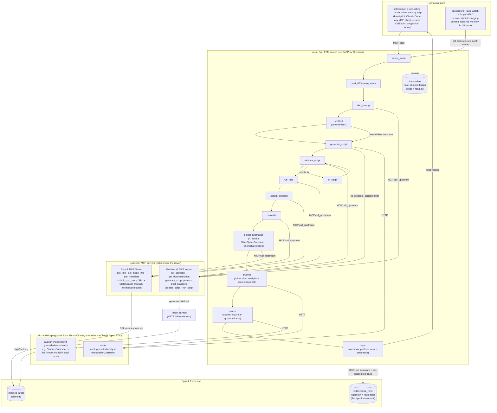

# kassi architecture

kassi is one AI agent that orchestrates two MCP servers through a durable,
state-machine-enforced workflow, then correlates client-side load-test results with
server-side telemetry in Splunk. It runs two ways: interactively (a tool-calling model drives
it via `kassi pilot` or any MCP client), or as a **diff-triggered background guard** (`kassi
watch`) that runs the whole workflow automatically the moment a commit changes an endpoint.

## System diagram



## System diagram (text)

Two views of the same architecture, rendered from the DOT sources in
[`docs/diagrams/`](docs/diagrams/) with [Graph::Easy](https://github.com/ironcamel/Graph-Easy)
(`graph-easy --input=docs/diagrams/run-orchestration.dot --as_boxart`). First, how a run is
driven and governed:

```
                                       ┌─────────────────────────────────────────────────┐
                                       │                how a run starts:                │
                                       │ driver (kassi pilot / Claude Code / MCP client) │
                                       │         or kassi watch (diff-triggered)         │
                                       └─────────────────────────────────────────────────┘
                                         │
                                         │ step / diff
                                         ▼
┌─────────────────────────────┐        ┌─────────────────────────────────────────────────┐
│   writer + auditor model    │  LLM   │      kassi: Burr FSM over MCP (Theodosia)       │
│ (pluggable: 8B or frontier) │ ◀───── │           driver sees ONE tool: step            │
└─────────────────────────────┘        └─────────────────────────────────────────────────┘
                                         │
                                         │ records
                                         ▼
                                       ┌─────────────────────────────────────────────────┐
                                       │               hash-chained ledger               │
                                       │             (every step + refusal)              │
                                       └─────────────────────────────────────────────────┘
```

Then the load-and-telemetry loop kassi orchestrates between the two MCP servers,
reading the target's server-side truth back from Splunk over the exact test window:

```
             ┌───────────────────────┐
  ┌────────▶ │ kassi (orchestrator)  │ ─┐
  │          └───────────────────────┘  │
  │            │                        │
  │            │ call_upstream          │
  │            ▼                        │
  │          ┌───────────────────────┐  │
  │          │    Grafana k6 MCP     │  │
  │          └───────────────────────┘  │
  │            │                        │
  │            │ k6 load                │ HEC: run + steps
  │            ▼                        │
  │          ┌───────────────────────┐  │
  │ findings │ target app (HTTP API) │  │
  │          └───────────────────────┘  │
  │            │                        │
  │            │ telemetry              │
  │            ▼                        │
  │          ┌───────────────────────┐  │
  │          │   Splunk Enterprise   │ ◀┘
  │          └───────────────────────┘
  │            │
  │            │ windowed SPL
  │            ▼
  │          ┌───────────────────────┐
  └───────── │   Splunk MCP Server   │
             └───────────────────────┘
```

The FSM phases run in order: `select_mode -> read_diff / parse_intent -> doc_lookup -> scaffold -> generate_script -> validate_script <-> fix_script -> run_test -> splunk_preflight -> correlate -> detect_anomalies -> analyze (writer) -> screen (auditor) -> report`. The driver hides both upstream MCP servers. k6 drives load at the target, the target's telemetry lands in Splunk, and kassi reads it back through the Splunk MCP Server, has the writer model explain it and a second model audit the explanation, then returns the verdict and publishes the run plus its own step trace to Splunk.

## How the application interacts with Splunk

After the k6 run, the `run_test` step records the wall-clock test window
(`run_started_at`, `run_ended_at`). The `splunk_preflight` step then verifies the target
index against the live server, capturing its event count, sourcetypes, and the Splunk
version via the `splunk_get_info`, `splunk_get_index_info`, and `splunk_get_metadata`
tools. The `correlate` step builds an SPL query scoped to the test window (default: an
error/latency rollup over the configured index; overridable per run) and calls the
official **Splunk MCP Server** `splunk_run_query` tool through Theodosia's
`call_upstream`. The Splunk MCP Server runs the SPL against Splunk Enterprise and returns
the server-side rollup, which kassi pairs with the client-side k6 metrics in the final
report. The `detect_anomalies` step then runs Splunk's own ML over the same window through
the same tool: the AI Toolkit's `StateSpaceForecast` forecasts the latency band (core
`predict` as a fallback when the toolkit is absent) and `anomalydetection` flags
statistically outlying buckets, so the saturation onset is found by Splunk's ML, not by a
fixed threshold in kassi. Connection is the official `mcp-remote` stdio bridge to the server's
streamable-HTTP endpoint, authenticated with an encrypted Bearer token. Every Splunk and
k6 tool call is recorded to the report's `mcp_provenance` block.

After `report`, kassi also writes *back* to Splunk over HEC: a `kassi:run` summary event and
one `kassi:step` event per executed state-machine phase (the agent's own walk), both keyed by
Burr's `app_id`. So the agent's execution is itself observable in Splunk, alongside the target
it tested, and the dashboard can render how the verdict was reached, step by step.

## How AI models and agents are integrated

Three layers of AI, kept deliberately narrow:

1. **The driving agent** decides which workflow step to take next. It sees only kassi's single
   `step` tool, and kassi's state machine refuses any illegal step and returns the legal next
   actions, so the agent's autonomy is bounded by construction and fully audited. The driver is
   pluggable: Claude Code or any MCP client, or a local open model via `kassi pilot` (`pilot.py`),
   which reads the reachable actions and calls `step` for each phase itself. With a local model,
   driver, writer, and auditor all run on one box, no cloud brain. There is also a **headless
   entry point, `kassi watch`** (`cli.py`): it polls a repo's git HEAD and, when a commit changes
   an endpoint, runs the same workflow in diff mode automatically, so the agent guards the repo and
   catches the regression at commit time, hands-free.
2. **A writer model** (a local IBM Granite 4.1 model by default, or Claude) authors the k6
   script on top of the deterministic scaffold, writes a cited analysis grounded on the run's
   evidence, proposes the remediation diff, and narrates the run. It never writes SPL; pure
   Python composes the correlation query, and the `scaffold` is the known-good fallback.
3. **An auditor model** (IBM Granite Guardian 4.1, the `screen` phase) independently judges
   whether the writer's analysis is grounded in the evidence it cites, before the verdict is
   published. The writer is not trusted on its own word. Keeping the work-phases deterministic
   and splitting writer from auditor keeps the blast radius of a bad model output small.

The architecture separates **orchestration from the model**. The driver and the writer/auditor are
behind a model-neutral surface (the MCP `step` tool; the `LLM` Protocol with an Ollama backend and a
Claude Agent SDK backend), so the model is pluggable: any capable tool-calling model can drive and
author, and the deterministic scaffold + ledger hold regardless. The same harness runs the whole
loop on a single local open 8B (on-prem, no cloud dependency) and scales up to a frontier model
unchanged; the design scales **with** the model, it does not depend on one.

## Data flow between services, APIs, and components

1. Driver calls `step(select_mode, …)`; kassi reads a git diff or scores an OpenAPI spec
   against a natural-language intent to pick endpoints.
2. `doc_lookup` calls the **k6 MCP server** documentation tools (`list_sections`,
   `get_documentation`) to ground the script and record citations.
3. `scaffold` deterministically composes a self-contained k6 baseline from the OpenAPI
   schema (no model).
4. `generate_script` fetches k6's `generate_script` prompt + `best_practices` resource and
   has the model author the final script on top of the scaffold (falling back to it).
5. `validate_script` and `run_test` call the **k6 MCP server**, which drives load against
   the **target service**. The target emits logs/metrics that Splunk indexes.
6. `splunk_preflight` calls the **Splunk MCP Server** to verify the index and capture its
   metadata before correlation.
7. `correlate` calls the **Splunk MCP Server** with windowed SPL to read that server-side
   telemetry back.
8. `detect_anomalies` calls the **Splunk MCP Server** again with the AI Toolkit's
   `StateSpaceForecast` (core `predict` as a fallback) and `anomalydetection` over the same
   window, so Splunk's own ML locates the anomaly.
9. `analyze` has the writer model produce the grounded, cited analysis and (in diff mode) the
   remediation diff.
10. `screen` has the auditor model (Granite Guardian 4.1) judge the analysis for groundedness;
    the pass/fail is sealed to the report.
11. `report` emits the combined client + server verdict to the driver (with the `mcp_provenance`
    record of every upstream tool call) and publishes to Splunk over HEC: a `kassi:run` summary
    and one `kassi:step` event per phase (the agent's state-machine walk, keyed by `app_id`).
12. Every transition and every refusal is written to Theodosia's immutable, hash-chained
    ledger; `kassi verify` confirms it has not been tampered with.
```
