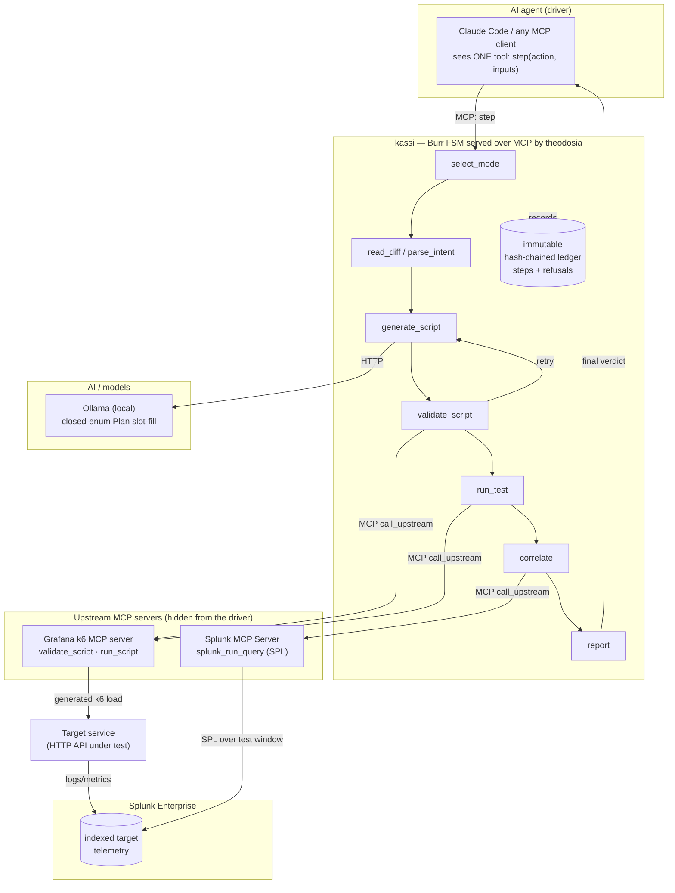

# kassi architecture

kassi is one AI agent that orchestrates two MCP servers through a durable,
state-machine-enforced workflow, then correlates client-side load-test results with
server-side telemetry in Splunk.

## System diagram



## How the application interacts with Splunk

After the k6 run, the `run_test` step records the wall-clock test window
(`run_started_at`, `run_ended_at`). The `correlate` step builds an SPL query scoped to
that window (default: an error/latency rollup over the configured index; overridable
per run) and calls the official **Splunk MCP Server** `splunk_run_query` tool through
theodosia's `call_upstream`. The Splunk MCP Server runs the SPL against Splunk
Enterprise and returns the server-side rollup, which kassi pairs with the client-side
k6 metrics in the final report. Connection is the official `mcp-remote` stdio bridge to
the server's streamable-HTTP endpoint, authenticated with an encrypted Bearer token.

## How AI models and agents are integrated

Two layers of AI, kept deliberately narrow:

1. **The driving agent** (Claude Code or any MCP client) decides which workflow step to
   take next. It sees only kassi's single `step` tool. kassi's state machine refuses any
   illegal step and returns the legal next actions, so the agent's autonomy is bounded by
   construction and fully audited.
2. **A local LLM** (Ollama) fills a typed, closed-enum `Plan` (test taxonomy,
   parameterization, per-endpoint emphasis). The model never authors k6 source or SPL;
   pure Python composes the script and the query. This keeps generation deterministic and
   the blast radius of a bad model output small.

## Data flow between services, APIs, and components

1. Driver calls `step(select_mode, …)`; kassi reads a git diff or scores an OpenAPI spec
   against a natural-language intent to pick endpoints.
2. `generate_script` calls Ollama for a Plan, then composes a self-contained k6 script.
3. `validate_script` and `run_test` call the **k6 MCP server**, which drives load against
   the **target service**. The target emits logs/metrics that Splunk indexes.
4. `correlate` calls the **Splunk MCP Server** with windowed SPL to read that server-side
   telemetry back.
5. `report` emits a combined client + server verdict to the driver.
6. Every transition and every refusal is written to theodosia's immutable, hash-chained
   ledger; `kassi verify` confirms it has not been tampered with.
```
